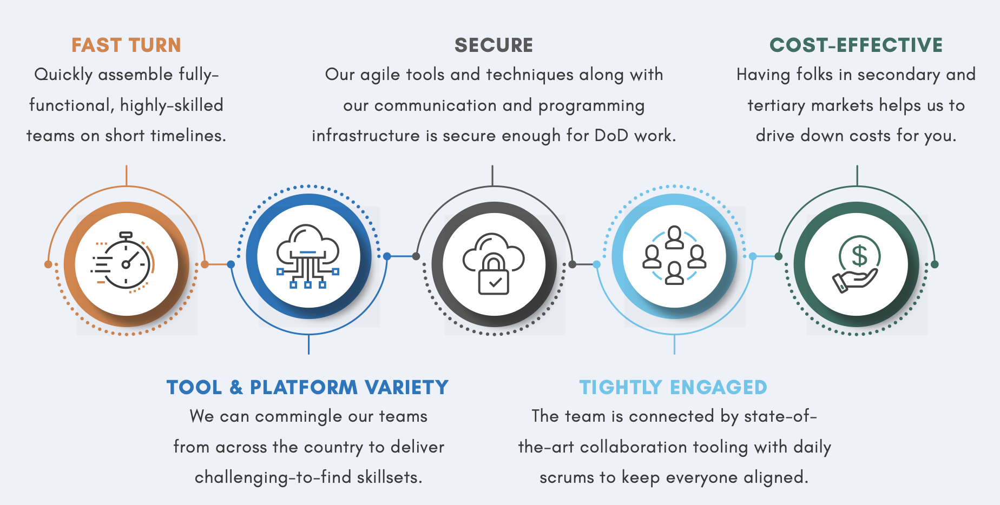

# REMOTE APPLICATION DEVELOPMENT PLAYBOOK

[Macro Solutions’](https://macrosolutions.com/services/rapid-application-delivery/) Remote Application Development (‘RAD’) Playbook provides guidance and processes needed to efficiently and effectively develop and deliver products that meet our customers’ needs. The Playbook enables our team to “hit the ground running,” providing significant benefit to our customers by increasing program management efficiency, decreasing program time and cost, reducing execution risks, and streamlining delivery.

### KEY PRACTICES

- Connectedness is critical – Emphasize the importance of video and being present.  Video meetings are not a time for multi-tasking.
- Building trust takes commitment – Trust is easier to build if teams have been working with the customer for some time, especially if they have met in person. For team members who have not met, trust may be low. Ensure team members have some time to interact socially (via video) as this will build a human connection and increase trust and productivity.
- Embrace flexibility – Remote support teams must work harder to remain connected and will often need to work early or late in the day to connect with colleagues. Find ways to incentivize flexible behaviors.
- Good audio etiquette is vital – Practice good meeting etiquette: remain on mute if you have background noise, don’t hog the microphone, take turns to speak (use the virtual “raise hand” in tooling that supports it), be polite, and keep an eye on chat for team members raising points to discuss.  Use earbud-style or wired headsets for best sound quality.

### THE PLAYS

Designed to address the execution process, this Playbook offers program managers and software engineers information on how Federal Agile Digital Services are integrated with remote development. Fundamentally, this Playbook provides the overall structure for how to implement Macro’s Remote Application Development processes and provides practical instructions to execute projects, filling in the gaps in the absence of any customer-provided methodology or tooling. The following plays are core to this approach and are covered in more detail in the following pages.

1.	[Remote Infrastructure](https://github.com/thagerdc/RAD-Playbook/blob/main/README.md#1-remote-infrastructure)
2.	[Virtual Communications](https://github.com/thagerdc/RAD-Playbook/blob/main/README.md#2-virtual-communications)
3.	[Managing Stakeholder Expectations](https://github.com/thagerdc/RAD-Playbook/blob/main/README.md#3-managing-stakeholder-expectations)
4.	[Ways of Working](https://github.com/thagerdc/RAD-Playbook/blob/main/README.md#4-ways-of-working)
5.	[Supporting People](https://github.com/thagerdc/RAD-Playbook/blob/main/README.md#5-supporting-people)
6.	[Digital Service Adoption](https://github.com/thagerdc/RAD-Playbook/blob/main/README.md#6-digital-service-adoption)

---

## 1. REMOTE INFRASTRUCTURE
The first component to support a remotely connected team is to ensure personnel have the necessary technology and hardware infrastructure in place to support the customer.

#### WHAT’S NEEDED

| Item | Description | Suggested Tools & Practices (Absent of Customer-Defined) |
| ---- | ----------- | -------------------------------------------------------- |
| Hardware | Laptop (or tablets), monitors, webcam, mic and speaker setup that works well enough for team collaboration | Laptop + Earbuds with noise cancellation (tablets for interactive design sessions) |
Constant Connectivity | All team members are expected to be available during core work hours and customer-agreed upon hours. Perform network checks on internal networks daily, cell phone connectivity and home network (when permitted). |
| VPN | Set up VPN, if required. Access has been tested and works. Backup plan in place if VPN fails (e.g. download the code if source control is unavailable). | Hot spot for phone connectivity |
| Security | Process in place to meet federal client security requirements (e.g. request access, user ID etc.). Team members are not relying on teammates for systems access. | In absence of GFE - hard drive encryption, device hardening, SSL, MDM, Password managers, Multi-factor authentication |
| Source control | The team can log on and use the source control tool (e.g. GitHub works on VPN). Make sure all your privately hosted or government services are available over VPN or other means. | GitLab, GitHub |
| Build pipelines & automation | The team can access and run the build and automation tools effectively. | CircleCI, AWS CodePipeline, Google Cloud Build |
| Environments | Team members can access test environments and databases remotely. | Production support can continue remotely, including access to logging and monitoring, deployments. | AWS, Azure |

---

## 2. VIRTUAL COMMUNICATIONS
Virtual communication and collaboration can be really challenging, however quickly establishing accessible collaboration tools and common virtual communication processes is a critical component for success.

#### WHAT’S NEEDED

| Item | Description | Suggested Tools & Practices (Absent of Customer-Defined) |
| ---- | ----------- | -------------------------------------------------------- |
| Chat | A single chat room tool that the whole organization is using to collaborate and share information. Teams or smaller groups can set up workspaces for specific purposes. The team has set up channels/groups for social interaction and team/ department announcements & notices. | Google Chat, Zoom Chat, Slack, Teams |
| Shared workspaces | A single place for teams to share project content, including but not limited to the output of problem-solving sessions, documents, presentations, etc. | Google Drive, One Drive, SharePoint, Confluence |
| Client meetings & showcases | A video conferencing tool is in use for client meetings and showcases. Connectivity supports screen sharing for real-time collaboration and software demos. Record calls for those for may be unable to attend. | Zoom, Hangouts Meet, MS Teams, GoToMeeting |
| Team wall / Board	|	Electronic wall/board used for story wall, planning, prioritizing and scheduling stories, epics. Data in the tool is up to date. Every team member updates their status as stories move through the development cycle. There is a dashboard showing progress plan/schedule/delivery, velocity, backlog sizing, etc. | Trello, Jira, Version One, Kanbanize |
| Whiteboard | A whiteboard sharing tool is in use and will allow the team to collaborate in a similar way the way they usually make use of a physical whiteboard. | Jamboard, Zoom, MS Whiteboard (possibly coupled with tablet or other facilitation hardware) |
| Retrospective | A Retrospectives tool is in use (or has been tested) by the team for retrospectives. The team has a board for retrospective action items. A video conferencing tool is in place for the team to discuss issues and process changes in confidence. | Trello, SharePoint, Confluence |
| Code review | There is a code review tool in use in the case where pairing is not possible (i.e. paired with on-site personnel). | GitHub, GitLab |
| Phone contacts | A consolidated list of phone contact numbers for all team members and key partners. Team members have these numbers on their phone contact list so they can text or call if internet or tools fail. | Google Contacts, MS Contacts, Confluence, SharePoint |

---

## 3. MANAGING STAKEHOLDER EXPECTATIONS
Managing stakeholder expectations when support is remote is essential to maintaining trust and confidence. It is human nature to worry more about something we can’t see or control than something we can. Instilling these principles into your work practices help to build and grow the strong relationships that are core to effective remote support.

#### WHAT’S NEEDED

| Item | Description | Suggested Tools & Practices (Absent of Customer-Defined) |
| ---- | ----------- | -------------------------------------------------------- |
| Trust | There are regular feedback sessions with stakeholders to understand, align and course correct where needed. In cases of low trust - communicate, communicate, communicate. Be transparent, keep electronic boards up to date, share dashboards, invite and answer questions. | 1:1 feedback and check-ins, regular showcases, IM channels, Trello/ Jira, regular video calls |
| Collaboration & transparency | The organization is open to, or already using, collaboration tools for documentation, presentations, planning and recording decisions. | G Suite, Microsoft Office 365, Trello |
| Risk management | There are regular risk management meetings with key stakeholders and/or program leadership. Consider moving these to a weekly cadence in the beginning to mitigate small issues becoming large over time. | Do these on video conference and prepare asynchronously in advance. Make risk logs visible to the whole team for collective ownership. |
| Communication & meetings | The daily, weekly, monthly and quarterly schedule of client meetings, reports and communications is formalized, documented and scheduled in calendars. Video conferencing details are included in the calendar invitations. Meeting summaries and/or recordings of call are shared so that all stakeholders are across updates. | Use the team’s shared workspace to keep track of meeting summaries and track actions as part of the team board. |
| Over communicate | Daily progress reports are shared with stakeholder(s) or client partner(s). It doesn't need to be long but maintains transparency and the sense of daily conversation, with the intent that any issues will be picked up within 24 hours. | Institute a daily touchpoint over VC. For overall responsiveness, consider the following graded approach: Instant response = phone, Minutes to hours = IM, < 24 hours = email |

---

## 4. WAYS OF WORKING
Establishing a clear, comprehensive governance structure, and defined ways-of-working provides transparency and guidance to teams, ensuring that everyone, regardless of their role and location, is aligned to new processes and mechanisms for working together remotely.

#### WHAT’S NEEDED

| Item | Description | Suggested Tools & Practices (Absent of Customer-Defined) |
| ---- | ----------- | -------------------------------------------------------- |
| Planning & scheduling | Story-sizing / estimation process is functioning and stabilized. Sprint planning or Kanban process is in place and functioning as intended. Story prioritization and story writing processes are in place. Team can depend on flow of stories ready for the next sprint, or meeting Kanban WIP limits in 'Ready for Dev'. | Trello/ Jira |
| Technical | Architectural guidelines are sufficient for a distributed team. Has diagrams, guiding principles, documentation to help team members stay true to the vision and agreed approaches. Supportive of onboarding new team members. Has daily tech huddle and weekly sessions that can be extended to all teams (remote or on-site). | Collaborative architectural diagrams using Google Drawings, Draw.io or Lucidcharts. Tech Huddles using online whiteboards |
| Performance | Velocity - is established and forecast delivery is closely monitored.  Cycle time - is being tracked and is used to actively improve processes.  Automation - CI Pipeline and test automation suite are running smoothly and giving the team reliable feedback. Nothing is commented out or skipped. |
| Standup | Daily stand-up (or scrum) meeting is tactical (not just ‘what I did yesterday’). Use a 'walk the wall' approach and discuss: ‘what do we need to do to get to done’, ‘who needs help’, ‘what pairs are we changing today’, etc. | VC and IM |
| Stand-down (afternoon check-in) | A second check-in, with mid-afternoon status, to highlight dependencies/blockers before people sign off for the day.  Alternatively, ask each person to leave a brief chat message as they leave the virtual team room at day's end saying where they got to today and if they're stuck, etc. | VC and IM |
| Showcase | One is held every iteration with an agenda to anchor the showcase and always attended by stakeholders. Has been tested with remote sharing technologies.  If not already in place, begin following up the showcase with an email documenting decisions and agreed actions. | Zoom, teams, GoToMeeting |
| Inception | When is the next inception, release planning or project ideation activity planned for? Consider how the activity might be conducted remotely with some adaptations, or broken down into shorter, more focused activities over a period, using electronic tools and video conferencing. | VC in combination with Trello, Jira, Version One, Kanbanize |
| Retrospective | There is a retrospective every iteration. Uses cycle time or other metrics to drive process improvement. Retro results in identifying action items, assigned to owners.  Action item progress is reviewed at start of next retro. | VC in combination with Trello, SharePoint, Confluence |
| Product design & vision | Product management and design processes are in place with responsibilities well understood. Product prioritization and trade-offs are happening and the team is aligned on what business outcomes they're working towards.  There is a plan for ways to replace face-to-face product/design sessions with remote alternatives for research, collaboration, ideation, workshops, etc. | Sketch/ Figma/ Adobe XD in combination with Zeplin or Invision for mockups and clickable prototypes and for designer-developer collaboration Balsamiq for wireframing |
| Working agreement (Team Charter) | Teams have documented, shared and aligned with their stakeholders, the expectations for remote working.  Core working hours have been agreed upon. Publish the schedule of days and times for your team's regular meetings and activities. | Shared calendars with recurring events |

---

## 5. SUPPORTING PEOPLE
While the right tools and processes are important for remote support, success is fundamentally about people. For remote support to be sustainable, it is critical that we consider the employee experience; becoming deliberate about how we engage, motivate and support our employees.

#### WHAT’S NEEDED

| Item | Description | Suggested Tools & Practices (Absent of Customer-Defined) |
| ---- | ----------- | -------------------------------------------------------- |
| Onboarding | There are processes in place and content in use for onboarding new team members. Consider following up the onboarding with a buddy system to help new team members settle in. Have training/learning materials and links ready for closing skills gaps or tech stack knowledge. | Use a team Wiki (Confluence/ Google Sites) to catalog the most important onboarding information; create an onboarding checklist; institute a “buddy” to onboard new people to the team. |
| Feedback | There is an established framework for 1:1 with team members. Consider moving to weekly for the period. Act on and follow up after 1:1 where there is a need.  Undertake a health check as part of the weekly 1:1. Confirm if team members are integrating and performing as expected.  Get help from HR or Leadership if you are unsure how to support team members. | In-context feedback during/ after routine collaboration (e.g. remote pairing), Regular 1:1 check-ins over VC. |
| Wellness | Teams have a process to update the organization of any illnesses or change in status for their team members.  Share information relating to the issues with the wider team, including status, actions and policy updates. Draw their attention to any company-wide communications. | Email; regular internal meetings; helpline for those who need it. |
| Ergonomics | Employees have an optimal workspace that supports productivity. The space should be quiet, free from distraction, with deskware that is comfortable for the required working hours. | Create an ergonomics policy (one-time or perpetual) to support this. |

---

## 6. DIGITAL SERVICE ADOPTION
To increase the success rate of Federal digital services projects, the U.S. Government developed the [Digital Services Playbook](https://playbook.cio.gov). It is comprised of 13 key recommendations drawn from successful practices from the private sector and government that help government build effective digital services.  

As noted on the site, “The American people expect to interact with government through digital channels such as websites, email, and mobile applications. By building digital services that meet their needs, we can make the delivery of our policy and programs more effective.”  

Adoption of these practices are necessary as they are foundational to the way we work.

### DIGITAL SERVICE PLAYS

- [Understand what people need](https://playbook.cio.gov/#play1)
- [Address the whole experience, from start to finish](https://playbook.cio.gov/#play2)
- [Make it simple and intuitive](https://playbook.cio.gov/#play3)
- [Build the service using agile and iterative practices](https://playbook.cio.gov/#play4)
- [Structure budgets and contracts to support delivery](https://playbook.cio.gov/#play5)
- [Assign one leader and hold that person accountable](https://playbook.cio.gov/#play6)
- [Bring in experienced teams](https://playbook.cio.gov/#play7)
- [Choose a modern technology stack](https://playbook.cio.gov/#play8)
- [Deploy in a flexible hosting environment](https://playbook.cio.gov/#play9)
- [Automate testing and deployments](https://playbook.cio.gov/#play10)
- [Manage security and privacy through reusable processes](https://playbook.cio.gov/#play11)
- [Use data to drive decisions](https://playbook.cio.gov/#play12)
- [Default to open](https://playbook.cio.gov/#play13)

---

